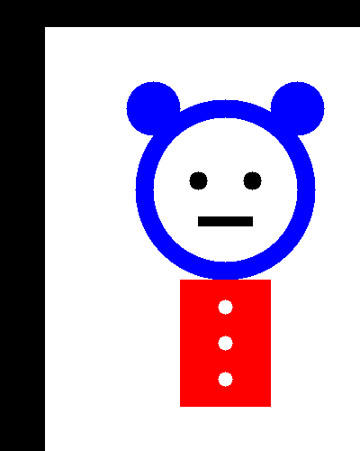
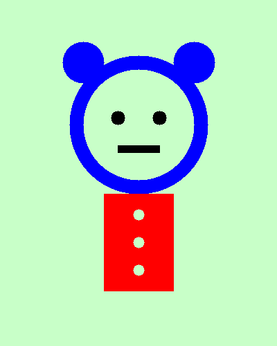
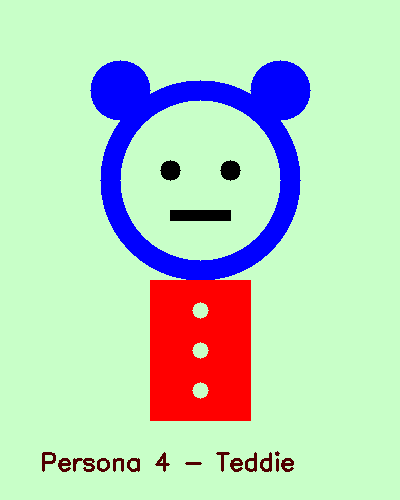

# UTS_ComputerVision_Muhammad_Ghasa_Rizaldi
# UTS Computer Vision – Karakter: Teddie (Kuma)

Nama: [Isi Nama Kamu]  
NIM: [Isi NIM]

 Deskripsi Karakter
Teddie (Kuma) adalah karakter maskot beruang dari game Persona 4. Karakter ini memiliki bentuk sederhana yang cocok dibuat dengan fungsi OpenCV seperti lingkaran dan persegi.

 Transformasi
- Translasi
- Rotasi
- Resize
- Crop

Operasi Bitwise
 Gabung karakter dengan background (`bitwise_and`, `add`)

 Screenshot

